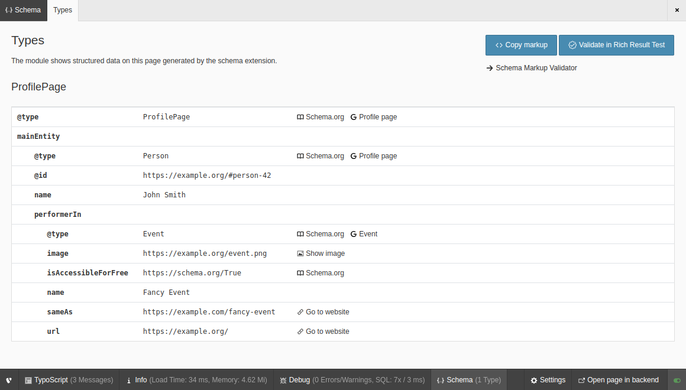

.. include:: ../Includes.txt

.. index:: Admin Panel

.. _admin-panel:

===========
Admin Panel
===========

Target group: **Integrators**, **Developers**

With an activated Admin Panel, you can display the structured data on a page
generated by this extension for reviewing:

   Types information in the Admin Panel

Icons are linked: The type to the according schema.org documentation and - if
available - to the Google reference for the specific type, other URLs to their
destination.
