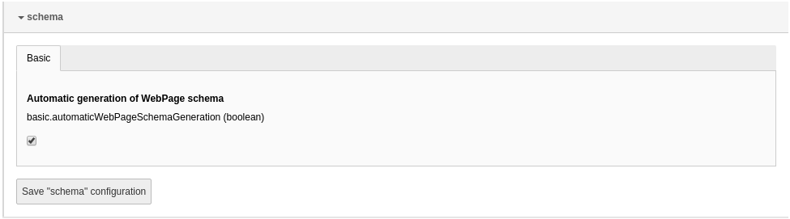

.. include:: ../Includes.txt

.. index:: Configuration

.. _configuration:

=============
Configuration
=============

Target group: **Developers, Integrators**

.. contents:: Table of Contents
   :depth: 1
   :local:

Extension Configuration
=======================

To configure the extension, go to :guilabel:`Admin Tools` > :guilabel:`Settings`
> :guilabel:`Extension Configuration` and click on the
:guilabel:`Configure extensions` button. Open the :guilabel:`schema`
configuration:

   Options in the extension configuration

.. index:: WebPage automatic embedding

.. _configuration-automaticWebPageSchemaGeneration:

basic.automaticWebPageSchemaGeneration
--------------------------------------

If this option is enabled, the ``WebPage`` type schema is automatically embedded
into the page. The web page type can be defined in the field
:guilabel:`Specific type of web page` of the :ref:`page properties <for-editors>`
and defaults to :ref:`WebPage <web-page-type>`.

Default value
   enabled

.. index::
   single: Breadcrumb automatic embedding

.. _configuration-automaticBreadcrumbSchemaGeneration:

basic.automaticBreadcrumbSchemaGeneration
-----------------------------------------

If this option is enabled, the breadcrumb is automatically generated from the
rootline of the current page.

Default value
   disabled

.. note::

   Since multiple breadcrumbs are allowed for a page, this option adds a
   breadcrumb to the possibly already existing ones (e.g. defined via the
   :ref:`API <breadcrumb-api>` or the
   :ref:`view helpers <breadcrumb-viewhelpers>`).

.. index:: Markup in body section

.. _configuration-embedMarkupInBodySection:

basic.embedMarkupInBodySection
------------------------------

If this option is enabled, the schema markup is embedded at the end of the
:html:`<body>` section. If it is disabled, it is embedded in the :html:`<head>`
section of the page.

Default value
   disabled

.. youtube:: lI6EtxjoyDU

Cache Configuration
===================

The extension stores some data temporarily, e.g. :ref:`additional type
properties <event-register-additional-properties>`. They are cached for better
performance. By default, the cache uses the default database backend cache. You
can reconfigure it to use a different cache backend. You can find further
information in the chapter :ref:`t3coreapi:caching` of the
TYPO3 documentation.

For example, place the following snippet in the :file:`ext_localconf.php` file
of your site package extension to use the file backend (which stored the data
in the file system) instead::

   if (!isset($GLOBALS['TYPO3_CONF_VARS']['SYS']['caching']['cacheConfigurations']['tx_schema']['backend'])) {
      $GLOBALS['TYPO3_CONF_VARS']['SYS']['caching']['cacheConfigurations']['tx_schema']['backend'] = \TYPO3\CMS\Core\Cache\Backend\FileBackend::class;
   }

