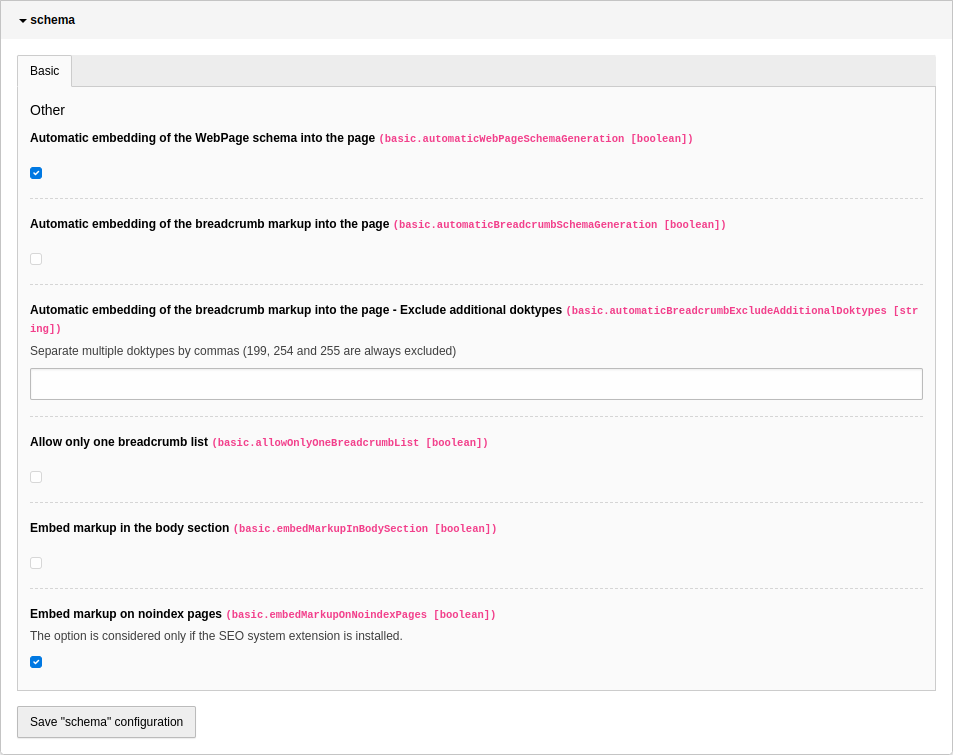

.. include:: ../Includes.txt

.. _configuration:

=============
Configuration
=============

Target group: **Developers, Integrators**

To configure the extension, go to Admin Tools > Settings > Extension Configuration and click on the "Configure extensions"
button. Open the "schema" configuration:

basic.automaticWebPageSchemaGeneration
--------------------------------------

If this option is activated (the default) the WebPage type schema is automatically inserted into the page
if the web page type is not set manually via the API or the view helper. The value of the page field
"Specific type of web page" is used as type. The type properties name (from page title), description (from
page description) and expires (only if page endtime is set) are defined.
