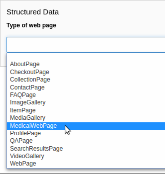

.. include:: ../Includes.txt

.. _extending-vocabulary:

========================
Extending the vocabulary
========================

Target group: **Developers**

.. contents:: Table of Contents
   :depth: 1
   :local:

Introduction
============

The TYPO3 schema extension ships :ref:`type models <api>` and :ref:`view helpers
<view-helpers>` with their properties from the core vocabulary of the Schema.org
definitions. However, there are several extensions, like `Health and medical
types <https://schema.org/docs/meddocs.html>`_ or `Autos
<https://schema.org/docs/automotive.html>`_. There are also `pending types and
properties <https://pending.schema.org/>`_ available that enable Schema.org to
introduce terms on an experimental basis.

The embedding of these vocabulary extensions goes beyond the scope of this TYPO3
extension, as it will considerably increase the number of terms – while most of
them are not used by the majority of users.

Pending terms are experimental, after a certain time a term will be incorporated
into the core vocabulary or dropped. This depends on the usage, adoption and
discussions. To maintain backward-compatibility and to not break any pages,
pending types are also not supplied by this extension.

But the vocabulary delivered with this extension can be extended according to
your needs. This chapter describes the necessary steps to register additional
properties to existing types or to introduce new types on your website.

.. _extending-register-additional-properties:

Register additional properties
==============================

You can use a slot or a PSR-14 event listener to add one ore more properties to
one or more types. The chapter :ref:`event-register-additional-properties`
describes how to register additional properties in detail.

.. note::

   Approximately every 2 months a new version of the Schema.org definitions
   is `released <https://schema.org/docs/releases.html>`_. The extension adopts
   these changes in future releases. If you register a pending property for
   a type, this property can be included in the core vocabulary in a later
   version of this extension. However, it doesn't do any harm to register a
   property that already exists.

.. _extending-adding-types:

Adding types
============

You can add additional types for use in the :ref:`API <api>` or as a
:ref:`WebPage type <webpage-types>`. As an example, in March 2020, Schema.org
introduces a new `VirtualLocation <https://schema.org/VirtualLocation>`_ type
related to the corona crisis, which also was also quickly adopted by Google.
The type can be used as `location <https://schema.org/location>`_ in the
`Event <https://schema.org/Event>`_ type. So let's start with this example.

.. rst-class:: bignums-xxl

#. Create the type model class

   The model class for a type defines the available properties. The model class
   for the `VirtualLocation` type may look like the following::

      <?php
      declare(strict_types=1);

      namespace Acme\LooneyTunes\Domain\Schema\Type;

      use Brotkrueml\Schema\Core\Model\AbstractType;

      final class VirtualLocation extends AbstractType
      {
         protected static $propertyNames = [
            'additionalType',
            'alternateName',
            'description',
            'disambiguatingDescription',
            'identifier',
            'image',
            'mainEntityOfPage',
            'name',
            'potentialAction',
            'sameAs',
            'subjectOf',
            'url',
         ];
      }

   That's it. In the example, the class is stored in
   :file:`Classes/Domain/Schema/Type` but you can choose any namespace. The
   protected static property :php:`$propertyNames` contains the available
   Schema.org properties.

   Now you can use the `VirtualLocation` in your PHP code::

      $location = \Brotkrueml\Schema\Type\TypeFactory::createType('VirtualLocation');
      $location->setProperty('url', 'https://example.com/looney-tunes-webinar-12345/register');

   .. important::
      The class name must be named after the type name of Schema.org. In this
      example, the type is called `VirtualLocation`, so the class name is
      :php:`VirtualLocation`.

#. Register the type model

   Now register the new type in the configuration file
   :file:`Configuration/TxSchema/TypeModels.php`::

      <?php
      return [
         \Acme\LooneyTunes\Domain\Schema\Type\VirtualLocation::class,
      ];

   As it is not mandatory to register the class for usage in the API only, the
   registry is utilised in various places (like view helpers). Please also note
   that this may be mandatory in future versions of the TYPO3 schema extension.

   After changes to the :file:`TypeModels.php` file the cache must be cleared.

.. note::
   As you can intentionally "override" a class model, e.g. the delivered
   `Person` class model with a customised one, but it is not recommended to do
   so. Instead, use the option to :ref:`register additional properties
   <extending-register-additional-properties>`.

.. important::
   Add the schema extension as a dependency to your extension. This ensures that
   your class models take precedence over the delivered models from the schema
   extension. This may be necessary if you define a pending type with pending
   properties (which you also use) to avoid breaks when the type is included
   into the core vocabulary but some properties aren't.

.. tip::
   Have a look into the
   `schema_virtuallocation <https://github.com/brotkrueml/schema-virtuallocation>`_
   extension. It serves as a blueprint for adding own types and view helpers.

Add a new WebPage type
======================

If you are responsible for a medical website, the chances are high that you need
the `MedicalWebPage <https://schema.org/MedicalWebPage>`_ web page type, which is
part of the Health Schema.org extension.

Register this web page type so that it is available in the :ref:`web page type
list <webpage-types-list>` in the page properties. Simply follow the steps in
the :ref:`extending-adding-types` section. Registration of the type model is
mandatory here.

Then mark your class as a WebPage type with the interface
:php:`Brotkrueml\Schema\Core\Model\WebPageTypeInterface`::

   <?php
   declare(strict_types=1);

   namespace Acme\LooneyTunes\Domain\Schema\Type;

   use Brotkrueml\Schema\Core\Model\AbstractType;
   use Brotkrueml\Schema\Core\Model\WebPageTypeInterface;

   final class MedicalWebPage extends AbstractType implements WebPageTypeInterface
   {
      protected static $propertyNames = [
         // ... the properties ...
      ];
   }

The new web page type can now be selected in the page properties:

   *MedicalWebPage* in the list of available web page types

Add a new view helper
=====================

As the API and thus the :ref:`defined model class <extending-adding-types>`
can be accessed in PHP, the use as a view helper in Fluid templates would also
be nice sometimes. If you have the need for this, simply create a new view
helper::

   <?php
   declare(strict_types=1);

   namespace Acme\LooneyTunes\ViewHelpers\Type;

   use Brotkrueml\Schema\Core\ViewHelpers\AbstractTypeViewHelper;

   final class VirtualLocationViewHelper extends AbstractTypeViewHelper
   {
   }

The view helper must extend the
:php:`Brotkrueml\Schema\Core\ViewHelpers\AbstractTypeViewHelper`. The view
helper must be named after the according type model. In the example the
:php:`VirtualLocationViewHelper` is connected to the :php:`VirtualLocation`
type model automatically.

Now you can use the view helper in a Fluid template (for example, when using the
`acme` namespace):

.. code-block:: html

   <schema:type.event
      name="Daffy Duck talks about the new movie"
      startDate="2020-03-23T19:00">
         <acme:type.virtualLocation
            -as="location"
            url="https://example.com/looney-tunes-webinar-12345/register"
         />
   </schema:type.event>

Every property name defined in the type model class is available as argument
in the view helper.
