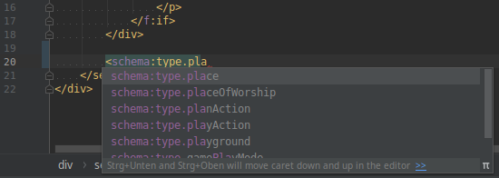

.. include:: ../Includes.txt
.. highlight:: html

.. index:: View helpers

.. _view-helpers:

======================
Using the view helpers
======================

Target group: **Developers, Integrators**

.. contents:: Table of Contents
   :depth: 3
   :local:

Introduction
============

With the help of :html:`<schema:type>` view helpers you can define schema markup
in Fluid templates. This can be helpful if you can't use the :ref:`API <api>`,
e.g. in third-party extensions.

Each type in the schema.org vocabulary is mapped into an according view helper.
The properties of a type are available as view helper arguments. As you will see
in the example, you can also nest view helpers into each other.

There are currently over 600 view helpers available.

.. _schema-type-view-helpers:

:html:`<schema:type>` view helpers
==================================

Let's start with a simple example. It's the same markup about John Smith as in
the API reference, so you can compare the differences.

Imagine you describe a `person <https://schema.org/Person>`__ on a plugin's
detail page that you want to enrich with structured markup::

   <schema:type.person
      -id="http://example.org/#person-42"
      givenName="John"
      familyName="Smith"
      gender="http://schema.org/Male"
   >
      <schema:type.event
         -as="attendee"
         name="Fancy Event"
         image="https://example.org/event.png"
         url="https://example.org/"
         isAccessibleForFree="true"
      >
         <schema:property -as="sameAs" value="https://twitter.com/fancy-event"/>
         <schema:property -as="sameAs" value="https://facebook.com/fancy-event"/>
      </schema:type.event>
   </schema:type.person>

Every type view helper starts with :html:`<schema:type.xxx>` where :html:`xxx`
is the lower camel case variant of the schema.org type name.

The according properties (like ``givenName`` and ``familyName``) are attributes.
You can find a list of all available properties for a specific type on the
schema.org page, e.g. for the `Person <http://schema.org/Person>`__.

In the example, there are two attributes that begin with a :html:`-`. They are
explained in detail in the chapter :ref:`view-helpers-special-attributes`.

As you can see, the value :html:`true` (and :html:`false` accordingly) can be
used. They are mapped later to the schema types ``http://schema.org/True`` and
``http://schema.org/False``.

Please also recognise the :html:`<schema:property>` view helper. With this view
helper you can pass more than one string value to the according type.

You can also use the default Fluid view helpers::

      <schema:type.blogPosting
         -isMainEntityOfWebPage="1"
         headline="{data.title}"
         description="{data.description}"
         datePublished="{f:format.date(format:'Y-m-d', date: data.publishDate)}"
      >
         <f:if condition="{data.lastUpdated}">
             <schema:property -as="dateModified" value="{f:format.date(format:'Y-m-d', date: data.lastUpdated)}"/>
         </f:if>
      </schema:type.blogPosting>

.. _view-helpers-special-attributes:

Special attributes
------------------

The special attributes are starting with a dash (:html:`-`) to separate them
from the common properties of the schema.org specification and to avoid
collisions. Let's have a deeper look on them.

.. _view-helpers-id:

.. option:: -id

This attribute sets a unique id for the type and is mapped in JSON-LD to the
``@id`` property. The LD in JSON-LD means "linked data". With an ``@id`` you can
define a type on one page (e.g. ``Event``):

.. code-block:: json
   :emphasize-lines: 4

   {
      "@context": "http://schema.org",
      "@type": "Event",
      "@id": "http://example.org/#event-1",
      "name": "Fancy Event",
      "image": "https://example.org/event.png",
      "url": "https://example.org",
      "isAccessibleForFree": "http://schema.org/True",
      "sameAs": ["https://twitter.com/fancy-event", "https://facebook.com/fancy-event"]
   }

and reference it on the same or another page (e.g. ``Person``):

.. code-block:: json
   :emphasize-lines: 10

   {
      "@context": "http://schema.org",
      "@type": "Person",
      "@id": "http://example.org/#person-42",
      "givenName": "John",
      "familyName": "Smith",
      "gender": "http://schema.org/Male",
      "attendee": {
         "@type": "Event",
         "@id": "http://example.org/#event-1",
         "name": "Fancy Event"
      }
   }

.. tip::

   You can also cross-reference the types between different websites. The
   ``@id`` is globally unique, so a best practise is to use an
   :abbr:`IRI (Internationalised Resource Identifier)` for it. It is also
   good practise to add the :html:`name` property as attribute.

.. _view-helpers-as:

.. option:: -as

This attribute is used to connect a type to its parent. In the above example,
you can see that the event type view helper uses :html:`-as` to connect to the
``attendee`` property of the person type view helper.

.. note::

   The usage of the attribute makes only sense in a child. If it is used in a
   parent type the view helper is ignored.

.. _view-helpers-specific-type:

.. option:: -specificType

Sometimes it can may be helpful to set a specific type. Imagine you have records
of places in the backend where you can select which type of specific place a
record has: e.g. ``Museum``, ``Airport``, ``Park`` or ``Zoo``. In a Fluid
template you can loop over these records when they are on the same page. But it
is not very convenient to use a :html:`<f:switch>` or :html:`<f:if>` view helper
to choose the correct type. For this scenario you can benefit from this
argument:

.. code-block:: html
   :emphasize-lines: 4

   <f:for each="{places}" as="place">
      <schema:type.place
         name="{place.name}"
         -specificType="{place.type}"
      />
   </f:for>

.. important::

   When using the :html:`-specificType` attribute you can only set the
   properties of the original type view helper (here: place), no additional ones
   from the specific type.

.. option:: -isMainEntityOfWebPage

This argument defines the type as the
:ref:`main entity <main-entity-of-web-page>` of a
:ref:`web page <web-page-type>`:

.. code-block:: html
   :emphasize-lines: 3

   <schema:type.person
      -id="http://example.org/#person-42"
      -isMainEntityOfWebPage="1"
      givenName="John"
      familyName="Smith"
      gender="http://schema.org/Male"
   />

which results in the output:

.. code-block:: json
   :emphasize-lines: 3-4,9

   {
      "@context": "http://schema.org",
      "@type": "WebPage",
      "mainEntity": {
         "@type": "Person",
         "@id": "http://example.org/#person-42",
         "givenName": "John",
         "familyName": "Smith",
         "gender": "http://schema.org/Male"
      }
   }

.. index:: property view helper

:html:`<schema:property>` view helper
=====================================

You can only set one string value in the argument of a type view helper, but
sometimes it is necessary to add more than one value to it. There comes the
property view helper into the game:

.. code-block:: html
   :emphasize-lines: 5-6

   <schema:type.corporation
      name="Acme Ltd."
      image="https://example.org/logo.png"
      url="https://example.org/"
   >
      <schema:property -as="sameAs" value="https://twitter.com/acme"/>
      <schema:property -as="sameAs" value="https://facebook.com/acme"/>
   </schema:type.corporation>

You can use as much property view helpers as you like for the same property. If
you prefer, you can combine the view helpers as follows::

   <schema:type.corporation>
      <schema:property -as="name" value="Acme Ltd."/>
      <schema:property -as="image" value="https://example.org/logo.png"/>
      <schema:property -as="url" value="https://example.org/"/>
      <schema:property -as="sameAs" value="https://twitter.com/acme"/>
      <schema:property -as="sameAs" value="https://facebook.com/acme"/>
   </schema:type.corporation>

The :html:`<schema:property>` view helper accepts two argument, both are
required.

.. option:: -as

You know already the :html:`-as` attribute from the :ref:`type view helpers
<schema-type-view-helpers>`. Its purpose is the same, it references the property
in the parent :html:`<schema:type>` view helper.

.. option:: value

The :html:`value` argument sets the value of the property, as you guessed
already.

:html:`<schema:breadcrumb>` View Helper
=======================================

This view helper is described in-depth in the chapter
:ref:`breadcrumb-view-helper`.

.. index:: XSD

Using the XML schema (XSD) in your code editor
==============================================

It is possible to assist your code editor on suggesting the tag name and the
possible attributes:

   Auto completion in PhpStorm with configured XSD schema

Just add the :html:`schema` namespace to the root element of your Fluid
template:

.. code-block:: html
   :emphasize-lines: 3-4

   <html
       xmlns:f="https://typo3.org/ns/TYPO3/CMS/Fluid/ViewHelpers"
       xmlns:schema="http://typo3.org/ns/Brotkrueml/Schema/ViewHelpers"
       schema:schemaLocation="https://brot.krue.ml/schemas/schema-1.7.0.xsd"
       data-namespace-typo3-fluid="true"
   >

The relevant parts are the namespace declaration
(:html:`xmlns:schema="http://typo3.org/ns/Brotkrueml/Schema/ViewHelpers"`)
and the :html:`schema:schemaLocation` attribute which points to the recent XSD
definition.

You can also import the XSD file into your favorite IDE after downloading it
from the following URL:
`https://brot.krue.ml/schemas/schema-1.7.0.xsd <https://brot.krue.ml/schemas/schema-1.7.0.xsd>`__.
