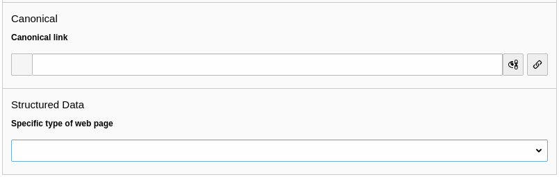

.. include:: ../Includes.txt

.. _for-editors:

===========
For Editors
===========

Target group: **Editors**

As an editor you have the possibility to adjust the type of every single web page for the schema markup. The default
value is the most generic one: *WebPage*.

You'll find the field in the page properties under the *SEO* tab (with installed seo system extension) or under the
*Metadata* tab (if the seo system extension is not installed):

   Field *Specific type of web page* in the page properties

If no value is selected, *WebPage* is assumed.

Available web page types
========================

.. _webpage-types-list:

================== ==================================================================================
Type               Description
================== ==================================================================================
WebPage            This is the most generic type for a web page
------------------ ----------------------------------------------------------------------------------
AboutPage          Page about the site, the organization, the person behind the site, etc.
------------------ ----------------------------------------------------------------------------------
CheckoutPage       Checkout page in a web shop
------------------ ----------------------------------------------------------------------------------
CollectionPage     Page about multiple things, like a paginated page listing blog posts, a product
                   category, etc.
------------------ ----------------------------------------------------------------------------------
ContactPage        Page with contact information
------------------ ----------------------------------------------------------------------------------
FAQPage            Page with frequently asked questions
------------------ ----------------------------------------------------------------------------------
ImageGallery       Page with an image gallery as the most valuable content
------------------ ----------------------------------------------------------------------------------
ItemPage           Page about a single item, e.g. a blog posting, a photograph, a product
------------------ ----------------------------------------------------------------------------------
ProfilePage        Page for user profiles
------------------ ----------------------------------------------------------------------------------
QAPage             A page with a question and one or more answers to this question
------------------ ----------------------------------------------------------------------------------
SearchResultsPage  Page for the result pages of the search function
------------------ ----------------------------------------------------------------------------------
VideoGallery       Page with a video gallery
================== ==================================================================================
