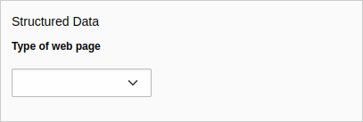

.. include:: ../Includes.txt

.. index:: WebPage page property

.. _for-editors:
.. _webpage-types:

==============
Web page types
==============

Target group: **Editors**

.. contents:: Table of Contents
   :depth: 1
   :local:

Adjustment of the web page type
===============================

As an editor you have the possibility to adjust the type of every single web
page for the schema markup. The default value is the most generic one:
``WebPage``.

You'll find the field in the page properties under the :guilabel:`SEO` tab
(with installed
`seo system extension <https://docs.typo3.org/c/typo3/cms-seo/master/en-us/>`__)
or under the :guilabel:`Metadata` tab (if the seo system extension is not
installed):

   Field *Type of web page* in the page properties

If no value is selected, *WebPage* is assumed.

.. note::

   If the seo system extension is installed and the checkbox
   :guilabel:`no_index` is activated, the field is not shown. This makes no
   sense on pages which are ignored by search engines. But you can override this
   behaviour with a
   :ref:`slot/PSR-14 event <event-de-activate-embedding-of-markup>`.

.. index:: WebPage types

Available web page types
========================

.. _webpage-types-list:

`WebPage` is the most common web page type, the other types are more specific:

+-+-+-+---------------+-----------------------------------------------------------------------------------+
| Type                | Description                                                                       |
+=+=+=+===============+===================================================================================+
| WebPage             | This is the most generic type for a web page                                      |
+-+-+-+---------------+-----------------------------------------------------------------------------------+
| | AboutPage         | Page about the site, the organization, the person behind the site, etc.           |
+-+-+-+---------------+-----------------------------------------------------------------------------------+
| | CheckoutPage      | Checkout page in a web shop                                                       |
+-+-+-+---------------+-----------------------------------------------------------------------------------+
| | CollectionPage    | Page about multiple things, like a paginated page listing blog posts, a product   |
| |                   | category, etc.                                                                    |
+-+-+-+---------------+-----------------------------------------------------------------------------------+
| | | MediaGallery    | A mixed-media page that can contains media such as images, videos, and other      |
| | |                 | multimedia                                                                        |
+-+-+-+---------------+-----------------------------------------------------------------------------------+
| | | | ImageGallery  | Page with an image gallery as the most valuable content                           |
+-+-+-+---------------+-----------------------------------------------------------------------------------+
| | | | VideoGallery  | Page with a video gallery                                                         |
+-+-+-+---------------+-----------------------------------------------------------------------------------+
| | ContactPage       | Page with contact information                                                     |
+-+-+-+---------------+-----------------------------------------------------------------------------------+
| | FAQPage           | Page with frequently asked questions                                              |
+-+-+-+---------------+-----------------------------------------------------------------------------------+
| | ImageGallery      | Page with an image gallery as the most valuable content                           |
+-+-+-+---------------+-----------------------------------------------------------------------------------+
| | ItemPage          | Page about a single item, e.g. a blog posting, a photograph, a product            |
+-+-+-+---------------+-----------------------------------------------------------------------------------+
| | ProfilePage       | Page for user profiles                                                            |
+-+-+-+---------------+-----------------------------------------------------------------------------------+
| | QAPage            | A page with a question and one or more answers to this question                   |
+-+-+-+---------------+-----------------------------------------------------------------------------------+
| | SearchResultsPage | Page for the result pages of the search function                                  |
+-+-+-+---------------+-----------------------------------------------------------------------------------+
